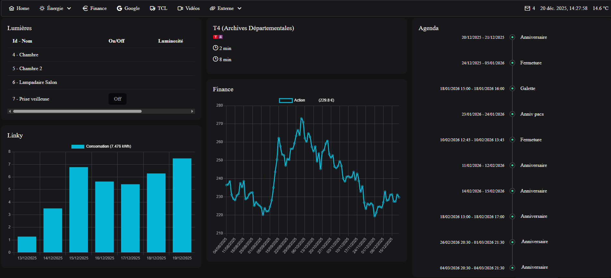

# 🏠 MyHome

> Tableau de bord personnel intégrant Google Calendar, Gmail, météo, transports en commun lyonnais, contrôle des lumières Philips Hue, consommation électrique Linky, données financières et bibliothèque vidéo.



## 📋 Vue d'ensemble

MyHome est une application web full-stack combinant :

- **Frontend** : Angular 20 (standalone components) avec PrimeNG et le thème Aura
- **Backend** : Express.js servant l'API et les fichiers statiques en production
- **Locale** : Entièrement en français (`fr-FR`)

## ✨ Fonctionnalités

### 🌐 Intégrations Externes

- **Google Calendar & Gmail** : OAuth 2.0 pour afficher événements et emails non lus
- **Météo** : Open-Meteo (Lyon)
- **TCL Lyon** : Horaires en temps réel des trams (ligne T4)
- **Philips Hue** : Contrôle des lumières connectées
- **Enedis Linky** : Suivi de la consommation électrique
- **Finance** : Données boursières via MarketStack
- **OMDB** : Métadonnées de films pour la bibliothèque vidéo

### 🎨 Interface

- Navigation par menu avec sous-menus (Énergie, Google, etc.)
- Barre d'en-tête avec horloge, température et compteur d'emails
- Dashboard modulaire avec cartes pour chaque service
- Thème moderne PrimeNG Aura

## 🚀 Démarrage Rapide

### Prérequis

- Node.js 18+
- npm ou yarn
- Clés API (voir [Configuration](#configuration))

### Installation

```bash
# Cloner le repository
git clone https://github.com/adelesse/my-home.git
cd my-home

# Installer les dépendances frontend
cd frontend
npm install

# Installer les dépendances backend
cd ../backend
npm install
```

### Développement

**Terminal 1 - Frontend (avec proxy)**

```bash
cd frontend
ng serve  # http://localhost:4200
```

**Terminal 2 - Backend (API)**

```bash
cd backend
node server.js  # http://localhost:3000
```

### Production

```bash
# Build complet (frontend + backend)
npm run build

# Lancer en production (le backend sert le frontend buildé)
npm start
```

L'application sera accessible sur `http://localhost:3000`

## ⚙️ Configuration

### Secrets Frontend

Créer `frontend/src/app/secret/secret.config.ts` :

```typescript
export const FINANCE_KEY = 'votre_cle_marketstack';
export const LINKY_KEY = 'votre_token_jwt_enedis';
export const LINKY_PRM = 'votre_numero_prm';
export const OMDB_API_KEY = 'votre_cle_omdb';
```

### Secrets Backend

Créer `backend/secret/google.config.json` (OAuth 2.0) :

```json
{
  "installed": {
    "client_id": "votre_client_id.apps.googleusercontent.com",
    "client_secret": "votre_client_secret",
    "redirect_uris": ["http://localhost:3000/auth/google/callback"]
  }
}
```

### Configuration Philips Hue

Éditer `frontend/src/app/energie/light/light.service.ts` :

```typescript
private ip = '192.168.1.XXX';  // IP de votre Hue Bridge
private key = 'votre_cle_api_hue';
```

### Serveur Vidéo

Éditer `backend/server.js` :

```javascript
const VIDEO_FOLDER = 'D:/Films'; // Chemin vers vos vidéos
```

## 🏗️ Architecture

### Structure du Projet

```
my-home/
├── frontend/          # Angular 20
│   ├── src/app/
│   │   ├── energie/   # Lumières, Linky
│   │   ├── google/    # Calendar, Mail
│   │   ├── finance/   # Données boursières
│   │   ├── meteo/     # Météo
│   │   ├── tcl/       # Transports TCL
│   │   ├── video/     # Bibliothèque vidéo
│   │   └── shared/    # Services réutilisables (cache, pipes)
│   └── src/proxy.conf.json
├── backend/           # Express.js
│   ├── server.js      # API + OAuth + Serveur statique
│   └── secret/        # Credentials Google (non versionné)
└── .github/
    └── copilot-instructions.md
```

### Patterns Clés

**Cache Unifié** : Tous les services externes utilisent `CacheService` avec localStorage et TTL

```typescript
const data = this.cacheService.get<T>(this.storageKey);
if (data) return of(data);

return this.http.get<T>(url).pipe(tap((data) => this.cacheService.set(this.storageKey, data, 24)));
```

**Injection Moderne** : `inject()` au lieu de constructor injection

```typescript
http = inject(HttpClient);
cacheService = inject(CacheService);
```

**Standalone Components** : Tous les composants Angular sont standalone (pas de NgModules)

## 🧪 Tests

```bash
cd frontend
ng test  # Karma + Jasmine
```

## 🎨 Formatage du Code

```bash
cd frontend
npm run format        # Formater tous les fichiers
npm run format:check  # Vérifier le formatage
```

Configuration Prettier incluse (`.prettierrc`)

## 📦 Technologies

### Frontend

- Angular 20
- PrimeNG + PrimeIcons
- Chart.js
- RxJS
- TypeScript 5.9

### Backend

- Express 5
- Google APIs (Calendar, Gmail)
- express-session (OAuth)
- CORS

## 🔒 Sécurité

- **OAuth 2.0** : Session-based pour Google APIs
- **CORS** : Restreint à `http://localhost:4200` en dev
- **Secrets** : Fichiers de configuration exclus du versioning (`.gitignore`)
- **Links** : Attributs `rel="noopener noreferrer"` pour les liens externes

## 📝 License

Ce projet est à usage personnel.

## 👨‍💻 Auteur

[adelesse](https://github.com/adelesse)

---

_Pour des instructions détaillées destinées aux agents IA, consultez [.github/copilot-instructions.md](.github/copilot-instructions.md)_
